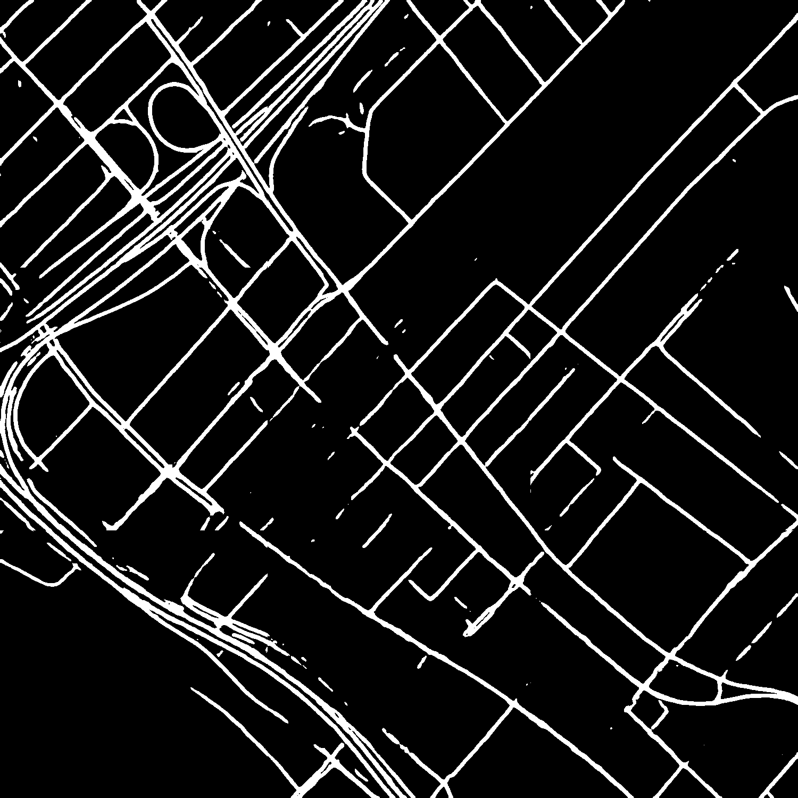
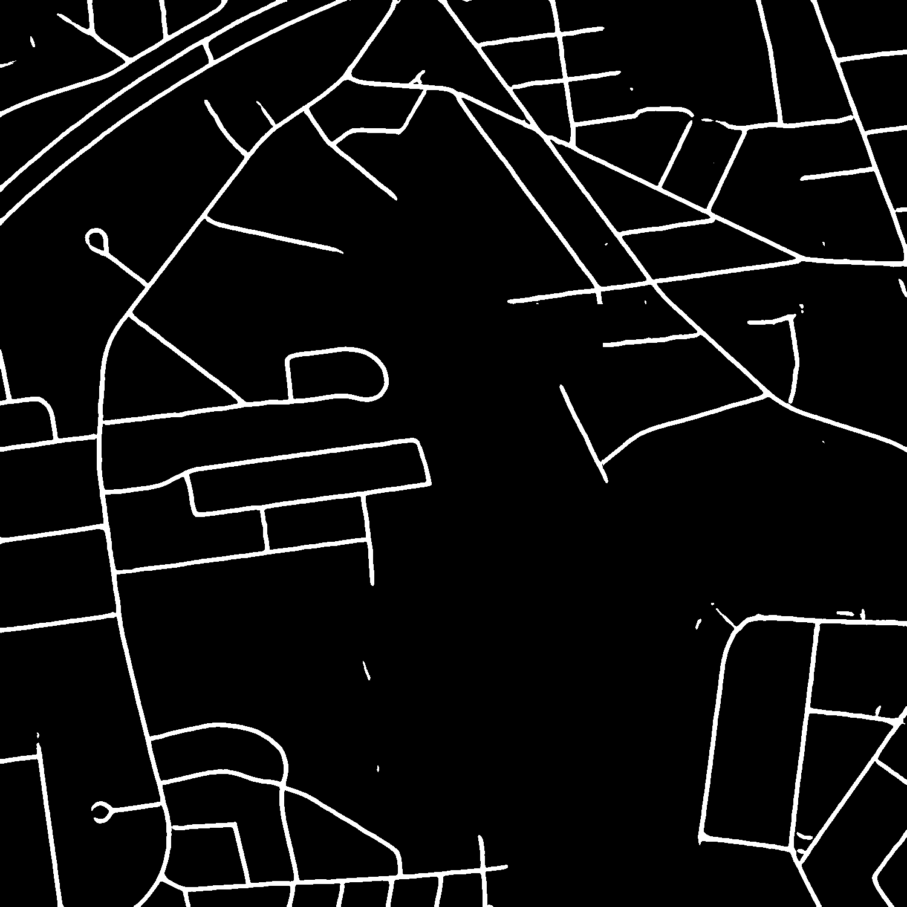
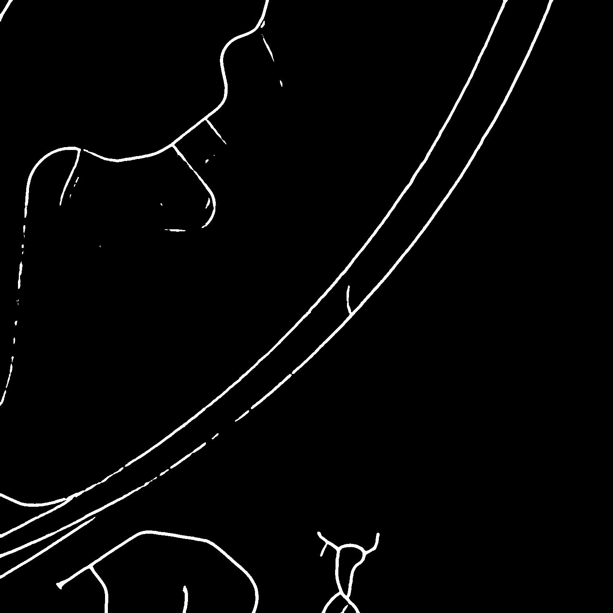

# Satellite Imagery Segmentation 

Goal of this project is to segment the road networks from satellite captured images.<br/>

I have refered and copied some code which I felt usefull from 
https://towardsdatascience.com/road-detection-using-segmentation-models-and-albumentations-libraries-on-keras-d5434eaf73a8. 

* Download dataset from - https://www.kaggle.com/insaff/massachusetts-roads-dataset

* unzip the dataset into root directory.

* Download saved model checkpoints from - https://drive.google.com/drive/folders/1-ntVfx7bju5hmuyvV_WkKnHwUS4et88b?usp=sharing 

* Best checkpoint - road_crop.10.h5

* download the model checkpoint file into root directory of the project.

Create conda environemt as follows to run the jupyter notebook project. 
```
conda env create -f environment.yml
```

## Approach used for solving the problem 

### Data Preprocessing Step

By manual evaluation of the images in training set I found that there are few images with white mask. So my first task was to remove those images as they can degrade the performance of the model. For finding out such images I checked if image contains pure white pixels greater than 2%. If yes then I removed those images from training set. 
Another thing was to split the image into 9 smaller chunks and create a batch of those chunks before passing it to model. After model prediction output batch of 9 images is merged to create a single image. This was done because a pretrained network weights were loaded which does not allows you change the input layer dimensions.

### Training Step

For training I first created LeNet architecture from scratch but model convergence was taking time and accuracy was also not good. So I decided to go with pretrained UNet network. Advantages of pretrained network is that they have already learnt to recognize much of the features. Now by using such models its easier and faster to train such model. I have used AWS p2xlarge  EC2 instance for training the model.

### Evaluation Step

For evaluating the model I have calculated iou, acurracy, precison and recall @ threshold = 0.1889<br/>
**IOU = 0.5943**<br/>
**Accuracy = 96.44**<br/>
**Precision = 0.7424**<br/>
**Recall = 0.7475**<br/>

Sample predicted images are as follows





